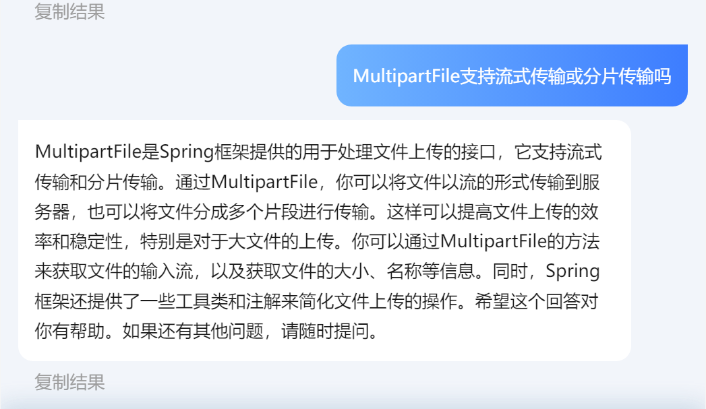

# 第四次作业

> 项目名: hvideo

其实从业务功能的角度考虑, 很多功能其实是有必要的,例如用es依据用户名查用户

还有依据点击量排序, 本来想的是用score,但是这个我之前没有用Client试过, 也要费好多时间, 也没有实现

但是我没做. 因为寒假太短, 我打算着在寒假多学一点消息队列和微服务, 下学期课太多了, 没啥时间,不能把太多时间放在作业上

所以这个项目看起来就会有点豆腐渣qwq

在家里反而学的比学校少了qwq, 家里十点必须上床了, 不能像在学校里一样作妖到两点了qwq,痛,实在是太痛了

## 目录

```text
C:\USERS\27970\DESKTOP\IT\JDK\HVEDIO
|   .gitignore
|   pom.xml
|   README.md
|   
+---.idea
|       ...
|
+---imgs
|       img0.png
|       img1.png
|       img2.png
|
+---src
    +---main
        +---java
        |   \---com
        |       \---harvey
        |           \---hvideo
        |               |   HVideoApplication.java
        |               |
        |               +---advice
        |               |       RestfulResponseAdvice.java
        |               |       WebExceptionAdvice.java
        |               |
        |               +---config
        |               |       ApplicationConfig.java
        |               |       MvcConfig.java
        |               |       MybatisConfig.java
        |               |       SecurityConfig.java
        |               |
        |               +---controller
        |               |       FollowController.java
        |               |       UploadController.java
        |               |       UserController.java
        |               |       VideoCommentController.java
        |               |       VideoController.java
        |               |
        |               +---dao
        |               |       FollowMapper.java
        |               |       UserMapper.java
        |               |       VideoCommentMapper.java
        |               |       VideoMapper.java
        |               |
        |               +---exception
        |               |       BadRequestException.java
        |               |       ForbiddenException.java
        |               |       ResourceNotFountException.java
        |               |       UnauthorizedException.java
        |               |
        |               +---interceptor
        |               |       AuthorizeInterceptor.java
        |               |       ExpireInterceptor.java
        |               |       LoginInterceptor.java
        |               |
        |               +---pojo
        |               |   +---dto
        |               |   |       LoginFormDTO.java
        |               |   |       RegisterFormDTO.java
        |               |   |       UserDTO.java
        |               |   |       VideoCommentDTO.java
        |               |   |       VideoDTO.java
        |               |   |
        |               |   +---entity
        |               |   |       Follow.java
        |               |   |       User.java
        |               |   |       Video.java
        |               |   |       VideoComment.java
        |               |   |
        |               |   +---enums
        |               |   |       Role.java
        |               |   |
        |               |   \---vo
        |               |           FileWithUserId.java
        |               |           Null.java
        |               |           Result.java
        |               |           ScrollResult.java
        |               |
        |               +---properties
        |               |       AuthProperties.java
        |               |       JwtProperties.java
        |               |
        |               +---service
        |               |   |   FollowService.java
        |               |   |   UploadService.java
        |               |   |   UserService.java
        |               |   |   VideoCommentService.java
        |               |   |   VideoService.java
        |               |   |
        |               |   \---impl
        |               |           FollowServiceImpl.java
        |               |           UploadServiceImpl.java
        |               |           UserServiceImpl.java
        |               |           VideoCommentServiceImpl.java
        |               |           VideoServiceImpl.java
        |               |
        |               \---util
        |                       Constants.java
        |                       JwtTool.java
        |                       RedisConstants.java
        |                       RedissonLock.java
        |                       RegexPatterns.java
        |                       RegexUtils.java
        |                       TimeUtil.java
        |                       UserHolder.java
        |
        \---resources
            |   application.yml
            |   hmall.jks
            |
            \---static
                    index.html
     

```

## 2.1

> 发烧中

### 用户

#### 用户表

```mysql
CREATE TABLE `tb_user`
(
    `id`          bigint unsigned                                              NOT NULL COMMENT '主键',
    `phone`       varchar(11) CHARACTER SET utf8mb4 COLLATE utf8mb4_general_ci NOT NULL COMMENT '手机号码',
    `password`    varchar(128) CHARACTER SET utf8mb4 COLLATE utf8mb4_general_ci         DEFAULT '' COMMENT '密码，加密存储',
    `nick_name`   varchar(32) CHARACTER SET utf8mb4 COLLATE utf8mb4_general_ci          DEFAULT '' COMMENT '昵称，默认是用户id',
    `icon`        varchar(255) CHARACTER SET utf8mb4 COLLATE utf8mb4_general_ci         DEFAULT '' COMMENT '人物头像',
    `role`        int                                                                   DEFAULT '1' COMMENT '用户权限',
    `create_time` timestamp                                                    NOT NULL DEFAULT CURRENT_TIMESTAMP COMMENT '创建时间',
    `update_time` timestamp                                                    NOT NULL DEFAULT CURRENT_TIMESTAMP ON UPDATE CURRENT_TIMESTAMP COMMENT '更新时间',
    PRIMARY KEY (`id`) USING BTREE,
    UNIQUE KEY `unique_key_phone` (`phone`) USING BTREE
) ENGINE = InnoDB
  DEFAULT CHARSET = utf8mb4
  COLLATE = utf8mb4_general_ci
  ROW_FORMAT = COMPACT COMMENT ='用户表'
```

#### 用户认证

通过俩拦截器ExpireInterceptor和LoginInterceptor共同完成

对于`hmall.jks`,是从别的项目拷贝过来的,使用了MD5加密

#### 用户权限

见enums.Role

## 2.2

> 发烧中

### 对于击穿,穿透和雪崩

主要体现在UserController的queryUserById,其他的地方我应该不会做这个了

没啥实际意义,单纯就是写一下

至于别的可能用到的地方, 太累了不想写

虽然可以提出来做一个工具类(我确实有一套),但我就是不想写😕,连复制也不想复制

### 对于授权

~~我就是不喜欢SpringSecurity帮我封装好, 我就是喜欢自己写~~

反正到最后都是要**自定义认证**,**自定义登录**啥的,**自定义授权**,不如一开始就用自己写的

而且会一直跳到自带的静态资源,老慢了,很烦,也不想写html.

而且不想准备role-permission表,烦

## 2.3

### 社交模块

1. 用户的关注、互关、取关

2. 获取单个用户的粉丝列表

3. 获取单个用户的关注列表

4. 获取单个用户的朋友列表（**当两个人互相关注，我们认为这两个人属于朋友**）

#### 关注中间表

```mysql
CREATE TABLE `tb_follow`
(
    `id`          bigint          NOT NULL AUTO_INCREMENT COMMENT '主键',
    `fan_id`      bigint unsigned NOT NULL COMMENT '粉丝id',
    `author_id`   bigint unsigned NOT NULL COMMENT '偶像id',
    `create_time` timestamp       NOT NULL DEFAULT CURRENT_TIMESTAMP COMMENT '创建时间',
    PRIMARY KEY (`id`) USING BTREE,
    KEY `tb_follow_author_id_index` (`author_id`),
    KEY `tb_follow_fan_id_index` (`fan_id`)
) ENGINE = InnoDB
  AUTO_INCREMENT = 1753699454547419139
  DEFAULT CHARSET = utf8mb4
  COLLATE = utf8mb4_general_ci
  ROW_FORMAT = COMPACT;
```

关注表就不用ES了, 所以都建了索引

### 甚至有推送功能哟

> 为此,出现了滚动分页,出现了inbox

其实是以前的项目的,一起拷过来了

### 好友

```mysql
use h_video;
select fan_id
from tb_follow
where fan_id in (
        select author_id
        from tb_follow
        where fan_id = '${id}'
    )
  and author_id = '${id}';
```

### 视频

#### 视频表

```mysql
CREATE TABLE `tb_video`
(
   `id`          bigint unsigned                                               NOT NULL AUTO_INCREMENT COMMENT '主键',
   `user_id`     bigint unsigned                                               NOT NULL COMMENT '用户id',
   `title`       varchar(255) CHARACTER SET utf8mb4 COLLATE utf8mb4_unicode_ci NOT NULL COMMENT '标题',
   `video_path`  varchar(127) CHARACTER SET utf8mb4 COLLATE utf8mb4_unicode_ci NOT NULL COMMENT '视频地址',
   `click`       int unsigned                                                           DEFAULT '0' COMMENT '点赞数量',
   `comments`    int unsigned                                                           DEFAULT NULL COMMENT '评论数量',
   `create_time` timestamp                                                     NOT NULL DEFAULT CURRENT_TIMESTAMP COMMENT '创建时间',
   `update_time` timestamp                                                     NOT NULL DEFAULT CURRENT_TIMESTAMP ON UPDATE CURRENT_TIMESTAMP COMMENT '更新时间',
   PRIMARY KEY (`id`) USING BTREE,
   UNIQUE KEY `video_path` (`video_path`),
   KEY `tb_video_click_desc_index` (`click` DESC) COMMENT ' 点击量降序索引',
   KEY `tb_video_user_id_index` (`user_id`) COMMENT '依据用户(作者)id查询视频'
) ENGINE = InnoDB
  AUTO_INCREMENT = 27
  DEFAULT CHARSET = utf8mb4
  COLLATE = utf8mb4_general_ci
  ROW_FORMAT = COMPACT
```

本来业务需求上还有封面啊,简介啊这种东西,但是这种东西没啥逻辑, 只是添一个字段, 我就不加进去了

我向来信奉: 能让产品想的, 开发就别动这个脑子.

#### 视频评论表

```mysql
CREATE TABLE `tb_video_comment`
(
    `id`          bigint unsigned                                               NOT NULL AUTO_INCREMENT COMMENT '主键',
    `user_id`     bigint unsigned                                               NOT NULL COMMENT '用户id',
    `video_id`    bigint unsigned                                               NOT NULL COMMENT '探店id',
    `parent_id`   bigint unsigned                                               NOT NULL DEFAULT '0' COMMENT '关联的1级评论id，如果是一级评论，则值为0',
    `content`     varchar(255) CHARACTER SET utf8mb4 COLLATE utf8mb4_general_ci NOT NULL COMMENT '回复的内容',
    `create_time` timestamp                                                     NOT NULL DEFAULT CURRENT_TIMESTAMP COMMENT '创建时间',
    PRIMARY KEY (`id`) USING BTREE,
    KEY `tb_video_comment_video_id_index` (`video_id`) COMMENT '视频id的索引',
    KEY `tb_video_comment_video_id_parent_id_index` (`video_id`, `parent_id`)
) ENGINE = InnoDB
  DEFAULT CHARSET = utf8mb4
  COLLATE = utf8mb4_general_ci
  ROW_FORMAT = COMPACT
```

对于用户的搜素记录为何保存在Redis而不是数据库,因为我不想再新建一张表了(懒)
总感觉表一多就显得很乱, 看见就心烦

## 2.4

> 评论和异步

异步使用了阻塞式队列...我不满意! 不够解耦合! 但是我不想启动MQ.....qwq


还有

1. 搜索
2. docker部署

-


```shell
docker build -t h-video .
docker run -d --name hv -p 8080:8080 --network hvideo h-video
docker logs -f hv
```

```shell
docker stop hv
docker rm hv
docker rmi h-video
rm -f hvideo-0.0.1-SNAPSHOT.jar 
```


```shell
docker network inspect hvideo
```

简要如下:

```json
[
    {
        "Name": "hvideo",
        "Id": "fdc8929e9f355aaa0460e156a9445ff2237b98e47d60956b80079d05596561fb",
        "Internal": false,
        "Attachable": false,
        "Ingress": false,
        "ConfigFrom": {
            "Network": ""
        },
        "ConfigOnly": false,
        "Containers": {
            "021d121aa37849d695d257437ebf96d7814bd7eba52de29ae2ac5712dc577630": {
                "Name": "redis"
            },
            "1505ef5ce4cec5cdee76244f082ee79cc145bef9714109c37513bab75e62d576": {
                "Name": "mysql"
            },
            "897e12590884d31a7e3682034ed334617ab564e137c130e5eb8a75c78bafe9fb": {
                "Name": "es"
            },
            "efbc576f839be06e8fe5987794ab7b5f3bb8406b391f80958145b5b9f9106e07": {
                "Name": "kibana"
            }
        },
        "Options": {},
        "Labels": {}
    }
]

```

## 2,6

### INDEX
PUT /h_video_video
```json
{
   "mappings": {
      "properties": {
         "all":{
            "type": "text",
            "analyzer": "ik_max_word"
         },
         "id":{
            "type": "keyword",
            "index": true
         },
         "userId": {
            "type": "keyword",
            "index": true
         },
         "nickName": {
            "type": "text",
            "analyzer": "ik_smart",
            "copy_to": "all"
         },
         "title": {
            "type": "text",
            "analyzer": "ik_max_word",
            "copy_to": "all"
         },
         "click": {
            "type": "integer",
            "index": true
         },
         "comments": {
            "type": "integer",
            "index": true
         },
         "videoPath": {
            "type": "text",
            "index": false
         },
         "icon": {
            "type": "text",
            "index": false
         },
         "createTime":{
            "type": "long",
            "index": true
         }
      }
   }
}
```

PUT /h_video_user

```json
{
  "mappings" : {
    "properties" : {
      "icon" : {
        "type" : "text",
        "index" : false
      },
      "nickName" : {
        "type" : "text",
        "analyzer" : "ik_max_word"
      },
      "id" : {
        "type" : "keyword"
      },
      "role" : {
        "type" : "integer",
        "index" : false
      }
    }
  }
}
```
video是Video,user是UserDTO


### 查询数据

视频默认排序
score*ln(kick)

GET /video/_search

```json

{
  "query": {
    "function_score": {
      "query": {
        "exists": {
          "field": "title"
        }
      },
      "functions": [
        {
          "script_score": {
            "script": {
              "source": "Math.log(1 + doc['kick'].value)"
            }
          }
        }
      ],
      "boost_mode": "multiply"
    }
  },
  "sort": [
    {
      "_score": {
        "order": "desc"
      }
    }
  ],
  "size": 20
}
```

- 依据点击量查
- 分页(当前第几页传参,一页多少写道常量里)


## 其他

关注表(中间表)

视频表-视频id(雪花),用户ID,title,video(path),点击量,创建时间,放弃做更新接口

点击量怎么实现?访问,queryByUser

点击量+时间, sortedSet,检查存在,然后10min时间一到删除Set内的userId(SpringTask)
(不行,会有分布式事物导致的异常)


### 任务

项目要求

- 提供一份**接口文档**和**项目结构图（目录树**）
- 完成Docker部署，编写Dockerfile并成功部署你的项目。
- 接口日志打印全面，入参出参，接口耗时等,啊? 不想写

#### 视频模块

1. 评论视频 （请注意，评论是可以有回复的) 再说
2. 点击量排行榜（Redis）

#### 搜索

- 搜索视频，用户（搜索条件包括但不限于：年份，类别，发布时间等等）查询ES
- 保留所有的历史搜索记录（Redis）啊?消耗服务器内存啊key:用户=List...
- 排序视频（点击量，发布时间）查询 ES

**没有完成数据同步!**由于Mysql的容器启动的比较早, 没有做数据卷挂载, 导致没法用Canal.
重新搞容器的话, 数据要重新导一遍, 很烦(说不定一个不小心就炸了, 我也不敢动它)
当然, 我也不想做侵入式的编程
以后做的话肯定先把数据卷挂载啦♥♥♥

##### 注意：

性能优化, 并发控制有实现

以下给出几个考虑方面：

**数据库优化**：

什么时候加索引？ 经常查询的依据的字段, 例如phone

如何防止索引失效？

(得)如何避免大事务？ 不知道

为什么要避免使用select * ？索引失效

**异步处理**：

上传视频这种耗时较长的任务是否可以用异步处理？

答:好吧

如果上传失败了, 不会通知用户(不想搞websocket), 而是会删除

**池化思想**：为什么建议创建线程池？

**限流**：如何防止流量过大的问题？有哪些限流方案？ (不知道

```text
我想着,如果用用户ID作为锁的话, 一个用户就不能疯狂发起请求了,就算发起了,也不能访问资源
而且用户不能大量创建, 因为电话号码不是这么好搞的
问题在于一个用户大量访问了资源, 占据了线程, 让其他一般用户无法访问了
虽然坏人没有访问到资源,一般人也很难访问到资源
我就想着在interceptor用userId搞把锁,把请求限制在interceptor
然后就会导致, 一个用户只能请求一次,合理吗?我在搜索的时候,卡了十秒
太无聊了, 我就新开了一个画面取查, 当前登录用户hash里面加一个字段吧
pre里减数据,到0锁住; post里加,加到20
没学过限流,只能靠自己的想象瞎说一点
至于为什么说是20, 因为我老妈说了10个太不尽兴了qwq
问题出现了: 由于在请求进入服务器和离开服务器时分别做一个incrBy的动作,
倘若其中有任何一次网络连接失败等原因而没有做incrBy的动作的话, 就会导致数据不一致的情况
但这俩逻辑分在pre和post, 不好做啊原子化qwq,否则用用Lua啥的qwq
```

要不就是用消息队列流量削峰

### Bonus

**如果你想挑战更多，可以考虑以下Bonus任务：**

1. 使用对象存储服务（如阿里云、腾讯云、七牛云）来存储大文件。

   - 不会啊,真不会啊

2. 实现大视频的分片处理。

   - 分片上传? 那不就是用MultiPartFile嘛





    - 分片存储? 
    
      日志分片存储也就算了,人家是字符文件, 可二进制文件分不分不是一样的吗?
      那用commons-io?


      人家Spring都用commons-io了,我还有什么话好说呢?

1. 添加管理员功能，以管理网站内容。（安全框架实现鉴权）

   - 这个网站没啥好管理的qwq

2. 使用**Elasticsearch**实现高效的搜索功能。


## 做了优化的方法

com.harvey.hvideo.service.impl.UserServiceImpl.queryUserByIdWithRedisson

用了Redisson做分布式锁 ,应对击穿

com.harvey.hvideo.service.impl.UserServiceImpl.getFromDbAndWriteToCache

用了假数据应对穿透

com.harvey.hvideo.service.impl.UploadServiceImpl.asynchronousSaveVideoFile

用异步保存了文件(保存到本地)

com.harvey.hvideo.service.impl.VideoServiceImpl.queryVideoByTittle

用ES依据标题查询视频信息, 一开始表没设计好, 应该多使用(video+video_info分开来这种的)

com.harvey.hvideo.service.impl.VideoServiceImpl.queryFollowVideos

使用滚动分页查询, 用拉模式实现的Timeline


# Java 第五轮考核
[第五次作业](https://github.com/HarveyBlocks/chat)

## 任务

编写一个 IM 即时通信系统

- 支持单聊, 群聊
- 支持查找**一定时间**内的聊天记录
- websocket模块
- 用户模块
- 联系人模块
- 信息模块
- 会话模块

redis->
聊天记录
key: list/zset + json -> from to content time 先入先出, 很合理

key? 俩人的id. 顺序怎么说? A->B和B->A是一样的
生成key的时候,把俩人的ID给比较一下, 然后再组合...?
MySQL里一张表, 三个字段: 用户1id, 用户2id, 他俩会话的id, id用雪花生成
要存俩组吗?还是说查的时候查两遍?
值是zset+json+timestamp
每次访问之前记录就删除过期的值?懒惰删除

会话接口,
from, to,
返回他俩的聊天记录

会话列表, 当前用户, 和谁有过对话?
MySQl的会话表, 用户1查所有用户2, 要存俩组吗?还是说查的时候查两遍?


- 聊天内容，使用Redis + Mysql的方式实现，
- 会话列表，
- 支持文字，图片交流，
- 屏蔽功能

### Bonus

1. 请考虑你的聊天系统的性能（例如使用Benchmark测试）
2. netty实现websocket
3. 考虑聊天传输的安全性（可以学习一下Telegram是如何保证传输安全性的，但是现阶段是做不到的，可以尝试做一些小的安全性优化）
4. 使用消息队列（RabbitMQ、RocketMQ、Kafka等）
5. 敏感词功能
6. ip获取+归属地
7. 未读消息数


## 参考

- `spring-boot-starter-websocket`
- 使用SpringBoot作为基础框架暴露http路由
- [WebSocket 的 6 种集成方式](https://juejin.cn/post/7111132777394733064)
- [SpringBoot如何集成RabbitMQ](https://juejin.cn/post/7155754742113632293)
